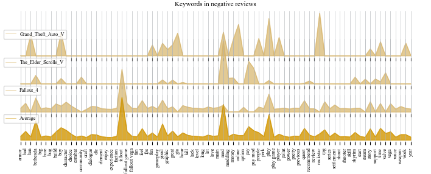

# Steaming Game Reviews - Analysis

### Description:
This is a repository for analysing textual reviews in terms of often appearing words or word combinations. We applied the code to two datasets of video game reviews from Steam (https://store.steampowered.com/).
The repository contains the code for the analysis we performed, as well as the datasets. It was created to showcase some of the experiments we did on the data, and to make it easy to reproduce our results.

### Datasets:
- Main dataset taken from: https://github.com/mulhod/steam_reviews/tree/master
- Additional data on Fallout 4 taken from: https://www.kaggle.com/datasets/andrewmvd/steam-reviews/data

### Prerequisites:
- install basic requirements using requirements.txt
- install spacy: 
	https://spacy.io/usage
- download spacy model for English language [en_core_web_lg]:
	https://spacy.io/models/en
- install sklearn:
	https://scikit-learn.org/stable/install.html

### Results:
The following plots show the most frequently used meaningful keywords in positive reviews and negative reviews of a few games from the dataset.
Our analysis makes it possible to get a quick overview over the topics that are most important to the player base of different games, according to their Steam Reviews.

